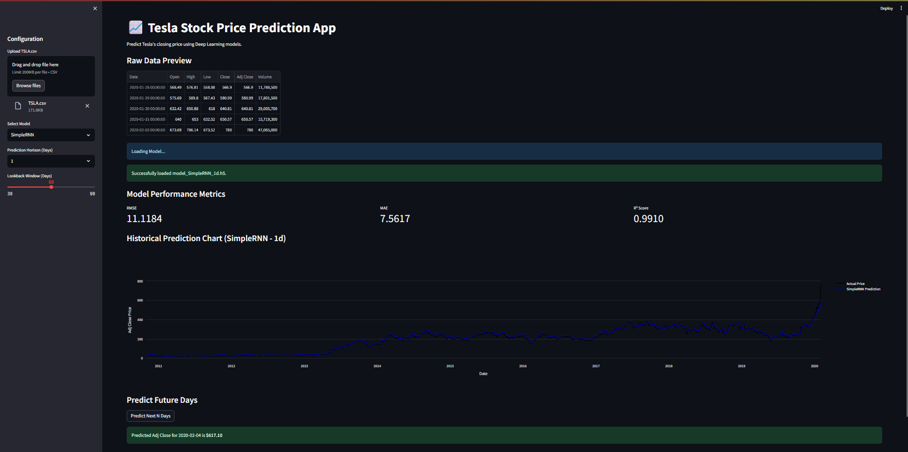

# 📈 Tesla Stock Price Prediction

An end-to-end Deep Learning project to predict Tesla (TSLA) stock prices using recurrent neural networks (RNN & LSTM). This project includes a comprehensive data analysis pipeline, technical indicator engineering, and an interactive Streamlit dashboard for real-time forecasting.

## 🚀 Project Overview

This repository contains a full machine learning workflow, from raw data ingestion to interactive deployment. We explore multiple Deep Learning architectures to capture temporal dependencies in financial time-series data.

### Key Features:
- **Exploratory Data Analysis (EDA)**: Interactive visualizations of price trends, volume, rolling averages, and daily returns.
- **Feature Engineering**: Integration of technical indicators like **RSI**, **MACD**, **Bollinger Bands**, and moving averages.
- **Deep Learning Models**:
  - **SimpleRNN**: Baseline recurrent model.
  - **LSTM**: Long Short-Term Memory network for long-term dependencies.
  - **Stacked LSTM**: Multi-layered architecture for complex pattern recognition.
  - **Tuned LSTM**: Optimized via GridSearchCV for peak performance.
- **Multi-Horizon Forecasting**: Models trained for **1-day**, **5-day**, and **10-day** prediction offsets.
- **Interactive Dashboard**: A Streamlit app that allows users to upload data, choose models, and visualize actual vs. predicted prices with Plotly.

## 📸 Screenshots

### 1. Main Dashboard & Data Preview


### 2. Model Evaluation & Visualization


## 🛠️ Installation & Setup

1. **Clone the repository**:
   ```bash
   git clone https://github.com/farheenfathimaa/tesla-stock-price-prediction.git
   cd tesla-stock-price-prediction
   ```

2. **Install dependencies**:
   ```bash
   pip install -r requirements.txt
   ```
   *Note: If you encounter DLL issues on Windows, `pip install tensorflow-cpu msvc-runtime` is recommended.*

3. **Run the Streamlit App**:
   ```bash
   streamlit run app.py
   ```

## 📊 Methodology

1. **Preprocessing**: Missing values are handled via Forward-Fill to maintain chronological integrity. Data is scaled using `MinMaxScaler` (0,1).
2. **Sequencing**: A 60-day sliding window is used to create input features for the models.
3. **Training**: Models are trained with `EarlyStopping` and `ModelCheckpoint` to prevent overfitting and save the best weights.
4. **Evaluation**: Performances are measured using **RMSE**, **MAE**, and **R² Score**.

## 📁 Repository Structure

```text
├── models/                     # Saved .h5 model weights (Ignored by Git)
├── screenshots/                # Application UI screenshots
├── TSLA.csv                    # Dataset
├── app.py                      # Streamlit dashboard code
├── tesla_stock_prediction.ipynb # Full pipeline notebook
└── .gitignore                  # Git exclusion rules
```

---
*Developed for Tesla Stock Price Prediction Research.*